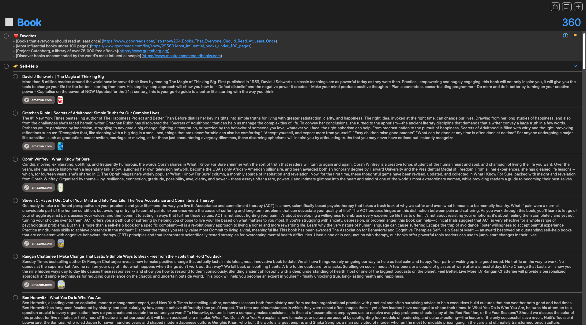
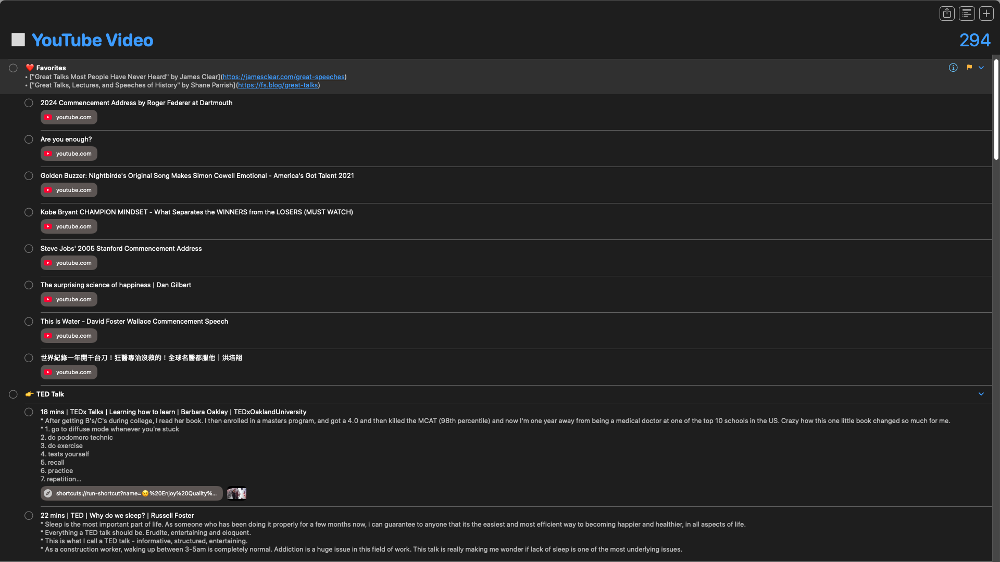
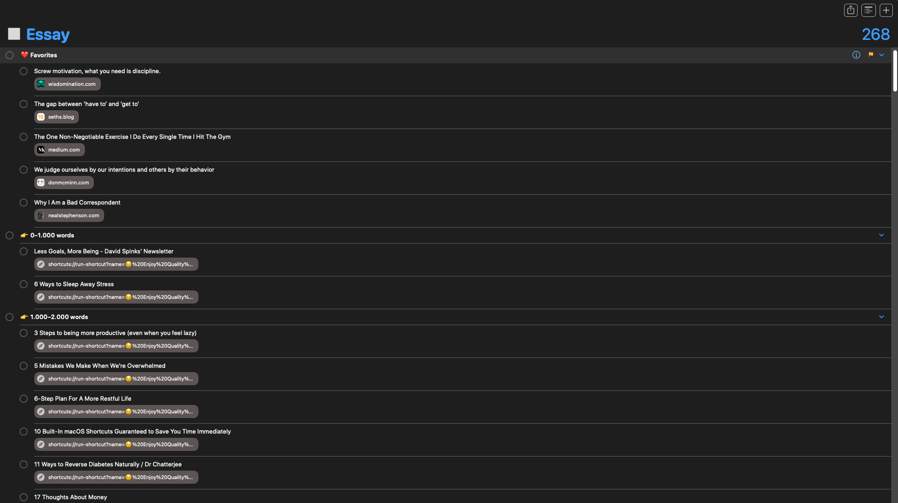
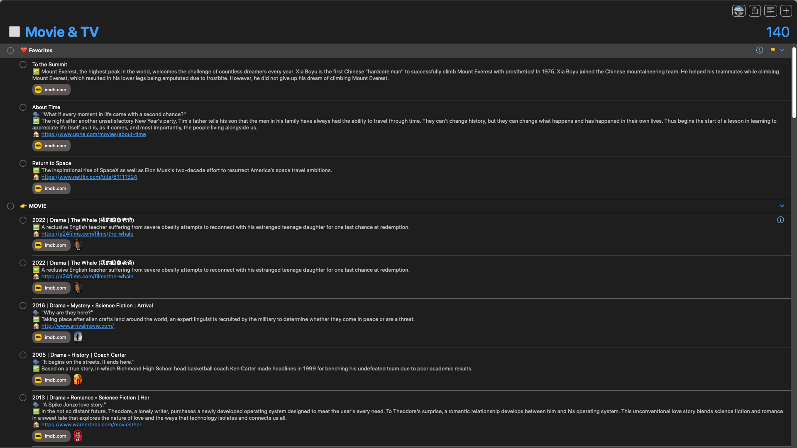
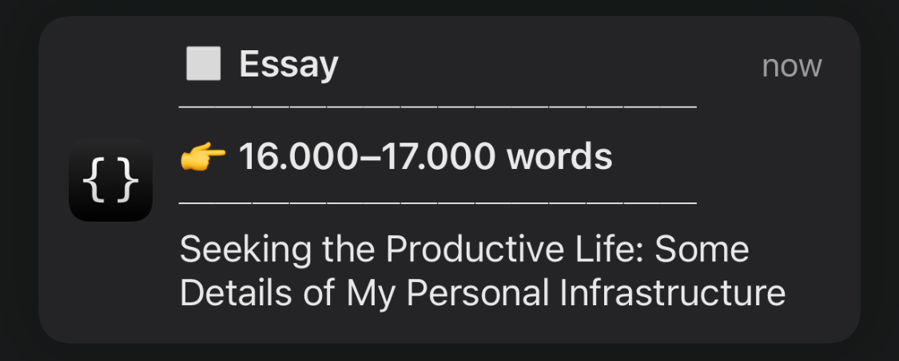

# Brain Food

## About

> _“Where is the wisdom we have lost in knowledge? Where is the knowledge we have lost in information?” ― T.S. Eliot, [The Waste Land and Other Poems](https://www.goodreads.com/work/quotes/15306654)_

The internet is noisy. This is my quiet corner. Here, I curated interesting _articles_, _books_, _podcasts_, _movies_, _TV shows_, and _YouTube videos_ to enjoy later. This project is my attempt to fight information overload, turning a stream of information into a source of knowledge and wisdom.

## Philosophy

> _“A man should keep his little brain-attic stocked with all the furniture that he is likely to use, and the rest he can put away in the lumber-room of his library, where he can get it if he wants it.” ― Arthur Conan Doyle, [The Adventures of Sherlock Holmes](https://www.goodreads.com/work/quotes/1222101)_

### 1. Declutter Your Feed

In today's world of information abundance, we're constantly bombarded with [never-ending](https://perell.com/essay/never-ending-now/) information. Most of what we consume is either created within the last 24 hours or recommended by “For You” algorithms.

We all know that fast food is bad for our bodies. So why consume junk that rot your brain?

What you read, watch, and listen to is as important as what you eat. Your information diet shapes your mind as much as your food shapes your body—the quality of your inputs determines the quality of your thoughts.

In an age of AI, you're not the average of the five people you spend the most time with, but the five information sources you consume most. Your digital environment influences your thinking just as much—_if not more_—than your physical surroundings. Remember that.

Be intentional about what you're feeding your brain. Don't blindly follow the algorithm. Pick what deserves your attention. Reclaim your [ultimate life currency](https://www.youtube.com/shorts/ii4YJK_-RTk). Brainwash yourself with [greatness](https://www.google.com/search?q=Lindy+Library).

### 2. Limit Content Consumption

It was one evening when I first came across Ali Abdaal's work on YouTube. His videos on productivity and personal development resonate deeply with me. They opened up a new world for me. I was deep into more self-improvement blogs and “life-changing” videos.

But soon, I fell into a trap. The more I clicked “Read Next” or “Watch Next,” the more I felt anxious and overwhelmed. My brain was short-circuiting. I knew I had to escape this trap.

So I made a rule for myself: **Only consume what I've already saved. No more impulsive consumption.**

This rule changed everything. The feeling of “not enough” faded away. I felt calm and peaceful. I no longer had the fear of missing out. I started choosing quality over quantity.

## How I Built This System

There are many “Read-It-Later” apps to save your reading queue: [Instapaper](https://www.instapaper.com/), [Readwise](https://readwise.io/), [Matter](https://hq.getmatter.com/), [Raindrop](https://raindrop.io), etc. These apps offer a centralized place to collect, sync, and read bookmarked content—often with features like highlighting, tagging, and offline access.

I tried each of these apps, but none of them suited my exact needs. The highlighting feature was distracting. It was hard to get my data out of their systems.

So I decided to build my own Read-It-Later system using [ Apple Reminders](https://support.apple.com/en-au/guide/reminders/welcome/mac) and [ Apple Shortcuts](https://shortcutomation.com).

Since Reminders is a native Apple app, I'm not dependent on a third-party service that could be discontinued, nor do I have to pay for a subscription. I fully own and control my data. No lock-in. I can [export all items](https://shortcutomation.com/gallery/brain-food/share-brain-food/) however I like, as you can see in this repository.

As a minimalist, I also appreciate that there's no ads or recommendation feed with this setup.

<table align="center">
<tr>
<td align="center">
<a href="assets/book.png">
<kbd>

</kbd>
</a>
 
Book
</td>
<td align="center">
<a href="assets/youtube-video.png">
<kbd>

</kbd>
</a>
 
YouTube Video
</td>
</tr>
<tr>
<td align="center">
<a href="assets/essay.png">
<kbd>

</kbd>
</a>
 
Essay
</td>
<td align="center">
<a href="assets/movie-and-tv.png">
<kbd>

</kbd>
</a>
 
Movie & TV
</td>
</tr>
</table>

The best part, however, comes from the integration with Shortcuts. I created automations to gather details for each “Brain Food” using the following APIs:

1. **[Movie & TV](https://huami.ng/bookmarks/movie-and-tv)**
	* [The Movie Database (TMDb) API](https://developer.themoviedb.org)
2. **[Podcast](https://huami.ng/bookmarks/podcast)**
	* [Spotify Web API](https://developer.spotify.com/documentation/web-api)
3. **[YouTube Video](https://huami.ng/bookmarks/youtube-video)**
	* [YouTube API](https://developers.google.com/youtube/v3/getting-started)
4. **[Book](https://huami.ng/bookmarks/book)**
	* [Google Books API](https://developers.google.com/books/docs/overview)
	* [Open Library API](https://openlibrary.org/developers/api)
	* [Library of Congress (LoC) API](https://www.loc.gov/apis)
5. **[Essay](https://huami.ng/bookmarks/essay)**
	* [Safari Reading List](https://support.apple.com/en-my/108970) [^1] [^2]

Reminders is more than a to-do list.

Titles, notes, images, and URLs are perfect for storing metadata, while clickable links open directly from each reminder. Subtasks let you organize entries by topic, category, or even word count. Tagging adds another layer of flexibility, making it easy to group and filter. You can even set a date to remind yourself to read, assign a priority level, or flag certain items to mark your favorites.

With cross-device iCloud sync, Reminders is a fully customizable database.

Searchable. Sortable. Shareable.

> [!TIP]
> _[Check out](https://github.com/huaminghuangtw/Evergreen-Lists) my other repository to see how I use Reminders for note-taking!_

### Tool

Download [this shortcut](https://shortcutomation.com/gallery/shared/brain-food/) to have a random “Brain Food” delivered straight to your Lock Screen.

<a href="assets/notification.png">
<kbd>

</kbd>
</a>

## Support

You can view this project at [huami.ng/bookmark](https://huami.ng/bookmark) and all shortcuts related to this project on [Shortcutomation](https://shortcutomation.com/gallery/brain-food). If you find this project valuable, please consider supporting my work by [buying me a coffee](https://buymeacoffee.com/huaming.huang).

## Contribution

Contributions are welcome! Please [open an issue](https://github.com/huaminghuangtw/Brain-Food/issues/new) or [submit a pull request](https://github.com/huaminghuangtw/Brain-Food/compare).

[^1]: For essays, I simply [exported the reading list items from Safari](https://shortcutomation.com/gallery/brain-food/export-safari-reading-list/). No API calls here.
[^2]: Safari's built-in Reading List provides several powerful features: it supports [offline reading](https://support.apple.com/en-my/108970#:~:text=You%20can%20read%20the%20web%20page%20later,%20even%20if%20you're%20offline.), enabling access to saved articles without internet; [Speak Screen](https://support.apple.com/en-my/guide/iphone/iph96b214f0/ios) can read articles aloud; and [Reader View](https://support.apple.com/en-my/guide/iphone/iphdc30e3b86/ios) gives you a focused reading experience.
