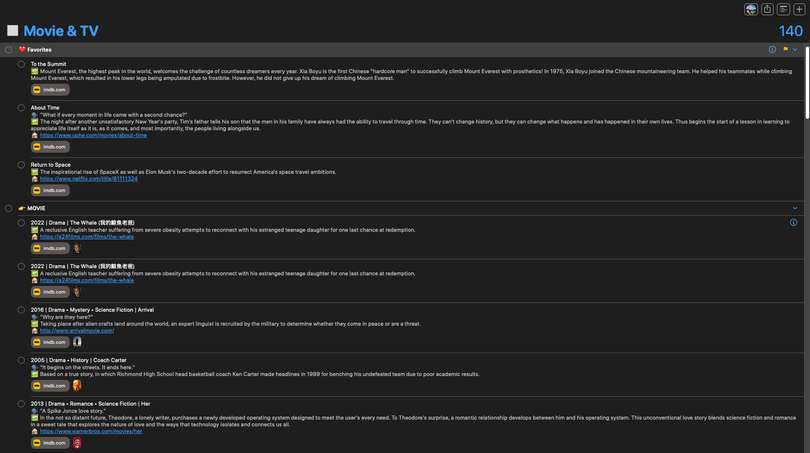

# Brain Food

## About

> _“Where is the wisdom we have lost in knowledge? Where is the knowledge we have lost in information?” ― T.S. Eliot, [The Waste Land and Other Poems](https://www.goodreads.com/work/quotes/15306654)_

This repository includes a collection of _articles_, _books_, _podcasts_, _movies_, _TV shows_, and _YouTube videos_ that I've [bookmarked](https://huami.ng/bookmarks) across the Internet.

In today's world of information abundance, we're constantly bombarded with information—fast, [endless](https://perell.com/essay/never-ending-now/), and often driven by algorithms. Most of what we consume is either created within the last 24 hours or recommended by “For You” feeds.

> _“I consider that a man's brain originally is like a little empty attic, and you have to stock it with such furniture as you choose. A fool takes in all the lumber of every sort that he comes across, so that the knowledge which might be useful to him gets crowded out, or at best is jumbled up with a lot of other things so that he has a difficulty in laying his hands.” — Sherlock Holmes_

Your information diet shapes your mind as much as your food shapes your body—the quality of your inputs determines the quality of your thoughts. In an age of information overload, you're not the average of the five people you spend the most time with, but the five information sources you consume most.

What you read, watch, and listen to is as important as what you eat. Your digital environment influences your thinking just as much—_if not more_—than your physical surroundings. Remember that.

Let this project inspire you to be intentional about what you're feeding your brain. Instead of depending on algorithms, take control and decide what deserves your attention. Choose wisely. Brainwash yourself with [greatness](https://www.thelindylibrary.org/).

## How I Built This Project

<table align="center">
<tr>
<td align="center">
<a href="assets/book.png">
<kbd>

</kbd>
</a>
 
Book
</td>
<td align="center">
<a href="assets/youtube-video.png">
<kbd>

</kbd>
</a>
 
YouTube Video
</td>
</tr>
<tr>
<td align="center">
<a href="assets/essay.png">
<kbd>

</kbd>
</a>
 
Essay
</td>
<td align="center">
<a href="assets/movie-and-tv.png">
<kbd>

</kbd>
</a>
 
Movie & TV
</td>
</tr>
</table>

#todo

I used [ Apple Shortcuts](https://shortcutomation.com/gallery/reminders-automation/organize-brain-food-lists/) to gather detailed metadata for each “Brain Food” in [ Apple Reminders](https://support.apple.com/en-au/guide/reminders/welcome/mac), leveraging the following APIs, and regularly [exported the results to JSON files](https://shortcutomation.com/gallery/brain-food/share-brain-food/), as you can see in this repository:

I used [ Apple Shortcuts](https://shortcutomation.com/gallery/reminders-automation/organize-brain-food-lists/) to collect rich metadata for each “Brain Food” item in [ Apple Reminders](https://support.apple.com/en-au/guide/reminders/welcome/mac), leveraging the APIs below. I then regularly [exported the results to JSON files](https://shortcutomation.com/gallery/brain-food/share-brain-food/), all of which are available in this repository:

1. **[Movie & TV](https://huami.ng/bookmarks/movie-and-tv)**
	* [The Movie Database (TMDb) API](https://developer.themoviedb.org)
2. **[Podcast](https://huami.ng/bookmarks/podcast)**
	* [Spotify Web API](https://developer.spotify.com/documentation/web-api)
3. **[YouTube Video](https://huami.ng/bookmarks/youtube-video)**
	* [YouTube API](https://developers.google.com/youtube/v3/getting-started)
4. **[Book](https://huami.ng/bookmarks/book)**
	* [Google Books API](https://developers.google.com/books/docs/overview)
	* [Open Library API](https://openlibrary.org/developers/api)
	* [Library of Congress (LoC) API](https://www.loc.gov/apis)
5. **[Essay](https://huami.ng/bookmarks/essay)**
	* [Safari Reading List](https://support.apple.com/en-euro/guide/iphone/iph1a4721132/ios) [^1]

Download [this shortcut](https://shortcutomation.com/gallery/shared/brain-food/) to have a random “Brain Food” delivered straight to your Lock Screen.

<a href="assets/notification.png">
<kbd>

</kbd>
</a>

## Contribution

Contributions are welcome! Please [open an issue](https://github.com/huaminghuangtw/Brain-Food/issues/new) or [submit a pull request](https://github.com/huaminghuangtw/Brain-Food/compare).

[^1]: For read-it-later essays, I simply [exported the reading list items in Safari](https://shortcutomation.com/gallery/brain-food/export-safari-reading-list/). No API calls here.
